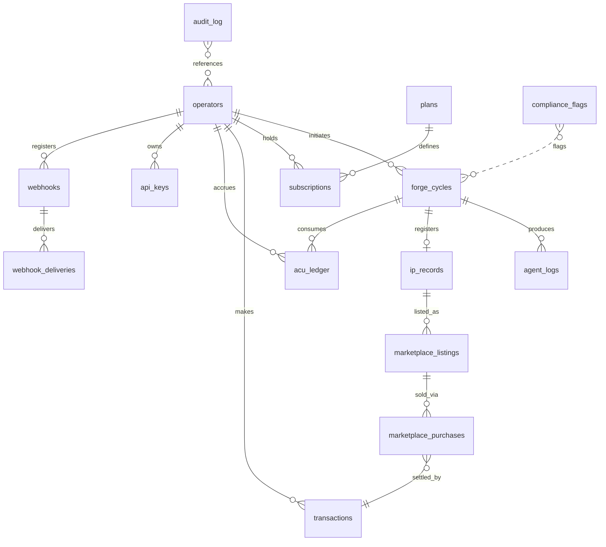

# JOSHRIX Studio — Database Schema

Primary relational store: PostgreSQL (GCP Cloud SQL). All primary keys are UUIDs.

## Core Entity Relationships

| Table | Primary Key | Key Fields | Relationships |
|---|---|---|---|
| operators | operator_id | email, name, tier, kyc_status, acu_balance, created_at, status | → forge_cycles, subscriptions, ip_records, transactions |
| forge_cycles | forge_id | operator_id, status, concept_brief, blueprint, qa_report, deployment_token, acu_consumed, created_at | → operators, agent_logs, ip_records, marketplace_listings |
| agent_logs | log_id | forge_id, agent_type, status, input_hash, output_hash, latency_ms, error_code, timestamp | → forge_cycles |
| ip_records | ip_id | forge_id, operator_id, title, ip_certificate_url, trademark_risk_score, licence_type, status, registered_at | → forge_cycles, operators, marketplace_listings, licence_assignments |
| marketplace_listings | listing_id | ip_id, operator_id, price, currency, licence_type, download_url, sales_count, status, listed_at | → ip_records, marketplace_purchases |
| marketplace_purchases | purchase_id | listing_id, buyer_id, transaction_id, licence_granted_at, download_count | → marketplace_listings, transactions, operators |
| transactions | txn_id | operator_id, amount, currency, type, gateway, gateway_txn_id, status, created_at | → operators, subscriptions, marketplace_purchases |
| subscriptions | sub_id | operator_id, plan_id, status, current_period_start, current_period_end, acu_allowance, bitripay_sub_id | → operators, plans |
| plans | plan_id | name, tier, price_monthly, price_annual, acu_included, forge_cycles_included, features_json | — |
| acu_ledger | ledger_id | operator_id, delta, balance_after, reason, forge_id, created_at | → operators, forge_cycles |
| api_keys | key_id | operator_id, key_hash, scope_json, is_active, last_used_at, ip_whitelist | → operators |
| webhooks | webhook_id | operator_id, url, events_json, secret_hash, is_active, failure_count | → operators, webhook_deliveries |
| webhook_deliveries | delivery_id | webhook_id, event_type, payload_hash, http_status, attempt_count, delivered_at | → webhooks |
| audit_log | audit_id | actor_id, actor_type, action, resource_type, resource_id, metadata_json, ip_address, timestamp | → (polymorphic reference) |
| compliance_flags | flag_id | resource_type, resource_id, flag_type, severity, status, raised_by, resolved_at, notes | → (polymorphic) |

## Entity Relationship Diagram



## Roles & User Profile

**RBAC roles:** `guest` · `creator` · `buyer` · `studio_owner` · `studio_member` · `admin` · `super_admin`.

**User profile fields:** userId, displayName, email, photoURL, role, country, currency, walletBalance, creditBalance, paymentCustomerId (BitriPay/Stripe), payoutAccountId (Connect-style), kycStatus, createdAt, lastLoginAt, status.

Capability boundaries: guests browse the marketplace, play demos, and view profiles but cannot create, sell, export, or earn; creators forge, publish, sell, and receive payouts; buyers purchase games/templates/assets/licences, download entitlements, request customisation, and review; studio users add team seats, roles, brand assets, bulk publishing, and white-label builds; admins moderate, control commissions, manage disputes and payouts, and see full platform intelligence.

## Application-Layer Data Model (TypeScript)

The creator-platform interfaces over the relational schema (contracts live in `packages/contracts`):

```typescript
interface Workspace {
  id: string;
  name: string;
  ownerUserId: string;
  type: "personal" | "team" | "business" | "enterprise";
  planId: string;
  acuBalance: number;
  createdAt: string;
}

interface GameProject {
  id: string;
  workspaceId: string;
  ownerUserId: string;
  title: string;
  description: string;
  genre: string[];
  maturity: "concept" | "prototype" | "alpha" | "beta" | "commercial" | "live";
  targetPlatforms: string[];
  engineProfile: string;
  activeVersionId: string;
  visibility: "private" | "unlisted" | "public";
  status: "draft" | "generating" | "testing" | "published" | "suspended";
  createdAt: string;
  updatedAt: string;
}

interface ProjectVersion {
  id: string;
  projectId: string;
  versionNumber: string;
  sourceCommit: string;
  blueprintVersionId: string;
  buildIds: string[];
  changeSummary: string;
  createdBy: string;
  createdAt: string;
}

interface AgentRun {
  id: string;
  projectId: string;
  agentType: string;
  objective: string;
  status: "queued" | "running" | "awaiting_approval" | "completed" | "failed" | "cancelled";
  inputRefs: string[];
  outputRefs: string[];
  acuEstimate: number;
  acuConsumed: number;
  providerCostGbp: number;
  modelRoute: string;
  startedAt?: string;
  completedAt?: string;
}

interface GameBuild {
  id: string;
  projectId: string;
  versionId: string;
  target: "web" | "android" | "ios" | "desktop" | "source";
  status: "queued" | "building" | "testing" | "ready" | "failed";
  artifactUrl?: string;
  checksum?: string;
  qualityGateId?: string;
  createdAt: string;
}

interface MarketplaceListing {
  id: string;
  sellerWorkspaceId: string;
  itemType: "game" | "template" | "asset" | "mechanic" | "service";
  title: string;
  description: string;
  priceGbp: number;
  licenceIds: string[];
  qualityScore: number;
  moderationStatus: string;
  status: "draft" | "review" | "published" | "suspended";
  createdAt: string;
  updatedAt: string;
}
```

## Critical Index Strategy

- **operators**: INDEX on email (UNIQUE), status, tier, kyc_status
- **forge_cycles**: INDEX on operator_id, status, created_at DESC (pagination)
- **agent_logs**: INDEX on forge_id, agent_type, timestamp DESC
- **ip_records**: INDEX on operator_id, status, trademark_risk_score, registered_at
- **marketplace_listings**: INDEX on status, listed_at DESC, price (range queries); GIN index on title for full-text search (Algolia synced)
- **transactions**: INDEX on operator_id, status, created_at DESC; INDEX on gateway_txn_id (UNIQUE)
- **acu_ledger**: INDEX on operator_id, created_at DESC (balance history)
- **audit_log**: INDEX on actor_id, resource_type + resource_id, timestamp DESC — this table is APPEND-ONLY with no UPDATE/DELETE permissions
